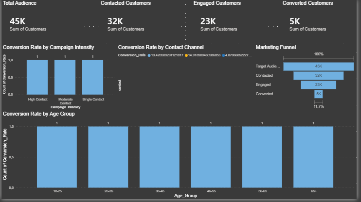

<p align="center">
  
</p>

<h1 align="center">📊 Marketing Funnel & Conversion Performance Analysis</h1>

<p align="center">


</p>

---

# 📌 Project Overview

This project analyzes a real-world marketing campaign dataset to understand how customers move through a marketing funnel—from initial contact to successful conversion.

Using Python for data preparation and Power BI for interactive dashboards, the analysis identifies where customers drop off, which marketing channels perform best, and what actions can improve conversion rates.

---

# 🎯 Business Problem

Marketing teams invest significant resources into customer acquisition campaigns, but not every contacted customer converts.

This project answers key business questions:

- Where are customers dropping off?
- Which communication channel performs best?
- Which customer segments convert the most?
- How does campaign intensity affect conversions?
- What improvements can increase marketing ROI?

---

# 📂 Dataset

**Source**

Bank Marketing Dataset (UCI Machine Learning Repository)

Records:

**45,211 customers**

Features:

- Age
- Job
- Education
- Contact Method
- Campaign
- Previous Outcome
- Duration
- Subscription Result

---

# 🛠️ Technologies Used

- Python
- Pandas
- NumPy
- Jupyter Notebook
- Power BI
- Git
- GitHub

---

# 📊 Marketing Funnel Performance

| Funnel Stage | Customers | Conversion Rate |
|--------------|----------:|----------------:|
| 🎯 Target Audience | 45,211 | 100% |
| 📞 Contacted | 32,191 | 71.20% |
| 💬 Engaged | 22,674 | 70.44% |
| ✅ Converted | 5,289 | 23.33% |

---

# 🔍 Key Insights

### 📱 Communication Channel Performance

| Contact Method | Conversion Rate |
|---------------|----------------:|
| Cellular | **14.92%** ✅ |
| Telephone | **13.42%** |
| Unknown | **4.07%** ❌ |

**Insight**

Cellular campaigns consistently produced the highest conversion rate, while customers contacted through unknown channels showed significantly lower engagement.

---

### 👥 Age Group Performance

| Age Group | Conversion Rate |
|-----------|----------------:|
| 65+ | **42.61%** ⭐ |
| 18–25 | **23.95%** |
| 56–65 | **14.12%** |
| 26–35 | **12.00%** |
| 36–45 | **9.39%** |
| 46–55 | **9.35%** |

**Insight**

Older customers demonstrated substantially higher conversion rates compared to middle-aged groups.

---

### 💼 Job Category Performance

Top-performing occupations:

- 🎓 Student (28.68%)
- 🏖️ Retired (22.79%)
- 👷 Unemployed (15.50%)
- 👔 Management (13.76%)

Lower-performing occupations:

- Blue-collar
- Housemaid
- Services
- Entrepreneur

---

### 🎓 Education Performance

| Education | Conversion Rate |
|-----------|----------------:|
| Tertiary | **15.01%** |
| Unknown | **13.57%** |
| Secondary | **10.56%** |
| Primary | **8.63%** |

Customers with tertiary education achieved the highest conversion rate.

---

# 💡 Business Recommendations

Based on the analysis, the following recommendations can improve future marketing campaign performance:

### 📱 Prioritize Cellular Campaigns
Cellular communication achieved the highest conversion rate (14.92%). Marketing efforts should prioritize this channel while reducing reliance on unknown contact methods.

### 🎯 Target High-Converting Customer Segments
Customers aged **65+**, students, retired individuals, and customers with tertiary education demonstrated significantly higher conversion rates. Future campaigns should allocate more budget toward these groups.

### 📞 Reduce Excessive Customer Contact
Customers contacted only once had the highest conversion rate (14.60%), while repeated contacts showed declining performance. Limiting unnecessary follow-ups can improve customer experience and reduce campaign costs.

### 🔄 Leverage Previous Successful Campaigns
Customers who previously responded successfully converted at an impressive **64.73%**. These customers should be prioritized for future marketing initiatives.

### 📊 Continuously Monitor Funnel Performance
Tracking funnel KPIs through Power BI dashboards enables marketing teams to quickly identify drop-off points and optimize campaign strategies.

---

# 📂 Project Structure

```text
FUTURE_DS_03
│
├── data
│   ├── bank-full.csv
│   ├── cleaned_marketing_funnel.csv
│   ├── funnel_metrics.csv
│   ├── age_performance.csv
│   ├── campaign_performance.csv
│   ├── channel_performance.csv
│   ├── education_performance.csv
│   ├── job_performance.csv
│   └── previous_campaign_performance.csv
│
├── images
│   ├── dashboard.png
│   └── conversion_outcome.png
│
├── notebooks
│   └── marketing_funnel_analysis.ipynb
│
├── powerbi
│   └── Marketing Funnel & Conversion Performance Analysis.pbix
│
├── requirements.txt
└── README.md
```

---

# 🚀 How to Run the Project

### 1️⃣ Clone the repository

```bash
git clone https://github.com/CraigChiambiro/FUTURE_DS_03.git
```

### 2️⃣ Install dependencies

```bash
pip install -r requirements.txt
```

### 3️⃣ Open the notebook

```text
notebooks/marketing_funnel_analysis.ipynb
```

### 4️⃣ Open the Power BI dashboard

```text
powerbi/Marketing Funnel & Conversion Performance Analysis.pbix
```

---

# 📌 Project Outcomes

✔ Cleaned and prepared a real-world marketing dataset.

✔ Calculated marketing funnel conversion rates.

✔ Identified customer drop-off points.

✔ Compared campaign performance across communication channels.

✔ Analyzed demographic conversion trends.

✔ Designed an interactive Power BI dashboard for business stakeholders.

✔ Delivered actionable recommendations to improve campaign performance.

---

# 👨‍💻 Author

**Craig Chiambiro**

🎓 BSc Information Technology (Data Science)

📍 Johannesburg, South Africa

🔗 GitHub: https://github.com/CraigChiambiro

💼 LinkedIn: https://www.linkedin.com/in/craig-chiambiro-6b3394257

---

<p align="center">
⭐ If you found this project interesting, consider giving it a star!
</p>

